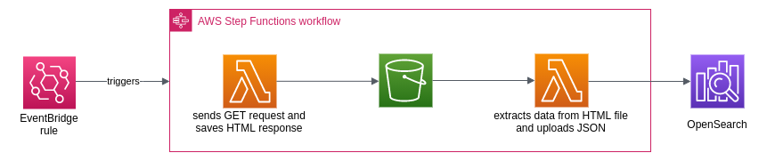

#  Infoshelf

A searchable information system made searchable with OpenSearch on AWS. It uses Lambda functions to regularly scrape latest data from your desired websites, parse, and upload for indexed search.

The demo is designed to track details of medical professionals on [Singapore Medical Council](https://prs.moh.gov.sg/prs/internet/profSearch/mshowSearchSummaryByName.action?hpe=SMC) for some work-related purpose, but this approach can easily be re-purposed for any other application. While doing so, please respect the website owner by limiting the rate of requests.

## Architectural diagram

## Components used

**Lambda functions** - The first lambda function 'request' sends GET requests to the source website and stores the HTML response in an S3 bucket. The next lambda function 'parse' reads our desired information from the HTML file and uploads the JSON to OpenSearch for indexing.

**S3** - stores intermediate output for historical records. Optionally, we can set object lifecycle policy to reduce costs.

**Step function** - coordinates the 2 lambda functions into an ETL workflow, ensuring completion of a task before the next. 

**OpenSearch** - acts as an alternative to a directory service. It stores contact information for individuals and enables full text queries.

**Eventbridge** - contains a rule to run data updates monthly (or any desired frequency).

## How to use the files

- `lambda_layers/` contains the dependencies utilized by the 2 lambda functions. Upload the zip files onto Layers. Alternatively, you can download the dependencies yourself using `pip install -t python` and zip the python folder.
- `lambda_request/` contains Python files for the 'request' Lambda function
- `lambda_parse/` contains Python files for the 'parse' Lambda function
- The step function definition is found in `stepfunction/statemachine_definition.json`. To define the entities to be scraped, refer to `stepfunction/executioninput.json` as input to the state machine.